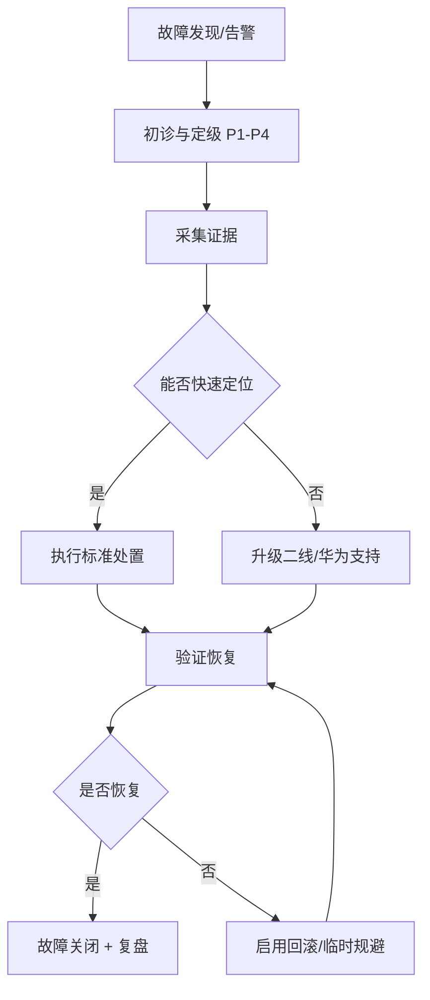

# 华为云 Stack 8.6.1 CodeArts 2.6.0
# 交付、运维与故障处理标准文档

| 项目 | 内容 |
|---|---|
| 文档名称 | CodeArts 交付、运维与故障处理标准文档 |
| 目标版本 | 华为云 Stack 8.6.1 |
| 软件版本 | HCS CodeArts Software 2.6.0 |
| 部署架构 | 混部架构（ExpansionCloudService） |
| 文档版本 | 01 |
| 适用对象 | 交付工程师、运维工程师、系统架构师、二线支持 |
| 编制依据 | 《华为云Stack 8.6.1 软件开发生产线服务软件包下载列表 01.xlsx》、本地 Deploy-Plugin 包、`CodeArts/` 目录产品文档 |

---

## 修订记录

| 版本 | 日期 | 修订说明 | 作者 |
|---|---|---|---|
| 01 | 2026-07-02 | 初版，基于 8.6.1 下载清单与 2.6.0 插件包结构编制 | — |

---

## 目录

1. [文档目的与适用范围](#1-文档目的与适用范围)
2. [术语与缩略语](#2-术语与缩略语)
3. [角色与职责](#3-角色与职责)
4. [总体架构说明](#4-总体架构说明)
5. [交付前准备标准](#5-交付前准备标准)
6. [标准交付流程](#6-标准交付流程)
7. [交付验收标准](#7-交付验收标准)
8. [日常运维标准](#8-日常运维标准)
9. [变更与扩容标准](#9-变更与扩容标准)
10. [备份与恢复标准](#10-备份与恢复标准)
11. [故障处理标准](#11-故障处理标准)
12. [常见故障案例库](#12-常见故障案例库)
13. [附录](#13-附录)

---

## 1. 文档目的与适用范围

### 1.1 文档目的

本文档用于规范华为云 Stack 8.6.1 环境下 **CodeArts 2.6.0** 的：

- 项目交付实施流程
- 日常运维操作标准
- 变更、扩容与升级约束
- 故障分级、响应与处置流程

确保交付过程可重复、可审计，运维与排障有统一依据。

### 1.2 适用范围

| 范围 | 说明 |
|---|---|
| **适用** | Stack 8.6.1 混部场景下 CodeArts 全栈或子集交付 |
| **适用子解决方案** | CodeArts 平台、Repo、Build、Pipeline、Check、Deploy、Req、Artifact、TestPlan、PerfTest |
| **不适用** | CodeArts Site 单站点 Turnkey（需使用 `*-Site-Deploy-Plugin` 及 Site 专用包） |
| **不适用** | 未在下载清单中勾选的服务（Board、IDE、Inspector、Governance、Doer 等） |

### 1.3 引用文档

| 文档 | 位置/说明 |
|---|---|
| 软件包下载列表 | `华为云Stack 8.6.1 软件开发生产线服务软件包下载列表 01.xlsx` |
| 各服务产品介绍 | `CodeArts/*产品介绍*.pdf` |
| 各服务使用指南 | `CodeArts/*使用指南*.chm` |
| 各服务用户指南 | `CodeArts/*用户指南*.pdf` |
| Stack 资源发放指南 | 《华为云Stack 8.6.1 资源发放指南》 |
| 插件内置卸载说明 | 各 `*-Deploy-Plugin-2.6.0.zip` 内 `scripts/uninstall/README.md` |

---

## 2. 术语与缩略语

| 术语 | 说明 |
|---|---|
| **HCCI** | 华为云交付部署编排引擎，CodeArts 通过 Deploy-Plugin 在其上执行安装 |
| **Deploy-Plugin** | 云服务部署插件包，内含 manifest、inspect、部署脚本 |
| **混部架构** | CodeArts 与 Stack 共用 VPC、MO、OBS、DB 等基础设施的部署模式 |
| **ExpansionCloudService** | HCCI 混部扩展云服务安装场景 |
| **CodeArtsBasic** | CodeArts 平台底座，提供网络、LB、中间件、IAM 等基础能力 |
| **DevUC** | 统一开发云账号与权限体系 |
| **ServiceHub** | 服务注册与 API 网关集成组件 |
| **UnifiedAccess2MO** | ManageOne 统一接入资源包 |
| **inspect.json** | 插件内软件包完整性校验规则 |
| **manifest.json** | 插件内安装步骤编排定义 |

---

## 3. 角色与职责

| 角色 | 职责 |
|---|---|
| **项目经理** | 确认交付范围、版本、工期；组织验收与变更审批 |
| **交付工程师** | 软件包下载校验、HCCI 工程创建、按序安装、交付文档输出 |
| **系统架构师** | 确认网络、规格、高可用、容量规划 |
| **运维工程师** | 日常监控、备份、证书、账号、故障初诊与升级 |
| **安全管理员** | 密钥轮换、权限审计、Cipher 变更插件执行审批 |
| **开发/测试代表** | 参与业务冒烟与 UAT 验收 |

### 3.1 RACI 简表

| 活动 | 交付 | 运维 | 架构 | 项目 |
|---|---|---|---|---|
| 包下载与校验 | R | C | I | A |
| HCCI 安装执行 | R | C | C | A |
| 日常监控 | C | R | I | I |
| 故障处理 | R | R | C | I |
| 变更/扩容 | R | R | A | A |
| 正式验收 | R | C | C | A |

> R=负责执行，A=审批，C=协作，I=知会

---

## 4. 总体架构说明

### 4.1 逻辑分层

```
用户层（浏览器/API/Webhook/Agent）
    ↓
业务服务层（Req / Repo / Build / Pipeline / Check / TestPlan / PerfTest / Deploy / Artifact）
    ↓
平台底座层（Basic / Console / DevUC / ServiceHub / WorkSpace / CloudOctopus / OpsBackup / DevMarket）
    ↓
Stack 基础设施（ManageOne / HCCI / OBS / GaussDB / MongoDB / VPC / ELB / APIGW / DNS / CCE）
```

### 4.2 安装依赖原则

**强制顺序（不可跳步）：**

1. Stack 公共配置（PublicConfig / OS_PublicConfig）
2. **CodeArtsBasic**（平台底座）
3. Console、DevUC、ServiceHub、WorkSpace、OpsBackup、CloudOctopus
4. ArtifactCore（若交付制品仓库）
5. 业务服务（Repo → Build → Pipeline → Check → Req → TestPlan → Deploy → Artifact → PerfTest）
6. 可选组件（DevMarket、DeskX）

### 4.3 关键集成点

| 集成点 | 作用 | 故障影响 |
|---|---|---|
| DevUC | 统一租户/项目/权限 | 全平台无法登录或授权失败 |
| ServiceHub + APIGW | 统一域名与 API 入口 | 门户 502/404、API 不可达 |
| OBS | 静态资源、大包存储 | Portal 白屏、部署包上传失败 |
| GaussDB / MongoDB | 业务元数据 | 服务启动失败、功能异常 |
| CMDB / CloudScope | 资源注册与运维视图 | MO 看不到云服务或资源残留 |
| OpsBackup | 备份策略注册 | 备份失败或无法恢复 |

---

## 5. 交付前准备标准

### 5.1 环境前置条件检查表

| 序号 | 检查项 | 标准 | 确认 |
|---|---|---|---|
| 1 | Stack 版本 | 8.6.1，与下载清单一致 | ☐ |
| 2 | ManageOne | 运营面、运维面可正常访问 | ☐ |
| 3 | HCCI | 部署工程能力可用，工程师账号权限满足 | ☐ |
| 4 | OBS | 项目已配置 OBS，容量满足大包存储 | ☐ |
| 5 | GaussDB | 实例可用，网络可达，账号权限满足 | ☐ |
| 6 | VPC/子网 | 二级 VDC 可创建 VPC、子网、NAT、安全组 | ☐ |
| 7 | API Gateway | 可注册服务、配置域名与证书 | ☐ |
| 8 | DNS | 全局/区域域名规划已确认 | ☐ |
| 9 | 证书 | 外部域名证书或自签策略已确定 | ☐ |
| 10 | 架构类型 | 下载清单选择「混部架构」 | ☐ |
| 11 | 浏览器 | 符合 Stack 8.6.1 资源发放指南建议 | ☐ |
| 12 | 磁盘空间 | 部署节点 `/home/pkg` 等路径空间充足 | ☐ |

### 5.2 软件包下载与校验标准

#### 5.2.1 下载要求

- 优先使用 **DownloadCenter** 工具下载并自动校验完整性
- 未使用 DownloadCenter 时，必须校验 `.asc` 签名或官方校验工具
- 仅使用华为工程师权限账号下载（见下载列表备注）
- 软件包版本必须与下载列表 **2.6.0** 强制配套，禁止混用其他版本

#### 5.2.2 本地包分类存放建议

```
CodeArts8.6.1/
├── 01_Platform/          # Basic、Console、DevUC、ServiceHub 等
├── 02_DeployPlugins/     # 全部 *-Deploy-Plugin-2.6.0.zip
├── 03_Business/          # Repo、Build、Pipeline 等业务大包
├── 04_Images/            # Build/Check/PerfTest 镜像包
├── 05_Portal_CDN/        # *Portal-CDN*.tar.gz
├── 06_UnifiedAccess/     # resource_10UnifiedAccess2MO_*
└── 07_Expansion/         # Modification、SwitchGaussDB 等变更插件
```

#### 5.2.3 必选 Deploy-Plugin 清单（当前项目）

| 序号 | 插件包 | 归属 |
|---|---|---|
| 1 | CodeArtsBasic-Deploy-Plugin-2.6.0.20260420220844.zip | 平台 |
| 2 | CodeArtsCommon-Deploy-Plugin-2.6.0.20260108180114.zip | 平台 |
| 3 | Console-Deploy-Plugin-2.6.0.zip | 平台 |
| 4 | DevUC-Deploy-Plugin-2.6.0.zip | 平台 |
| 5 | ServiceHub-Deploy-Plugin-2.6.0.zip | 平台 |
| 6 | CodeArtsWorkSpace-Deploy-Plugin-2.6.0.130588704.zip | 平台 |
| 7 | CloudOctopus-Deploy-Plugin-2.6.0.zip | 平台 |
| 8 | OpsBackup-Deploy-Plugin-2.6.0.zip | 平台 |
| 9 | DevMarket-Deploy-Plugin-2.6.0.20260414111706.zip | 平台 |
| 10 | CodeArtsArtifactCore-Deploy-Plugin-2.6.0.B070.060.zip | 制品 |
| 11 | CodeArtsArtifact-Deploy-Plugin-2.6.0.B094.013.zip | 制品 |
| 12 | CodeArtsRepo-Deploy-Plugin-2.6.0-20260420173714.zip | 代码托管 |
| 13 | CodeArtsBuild-Deploy-Plugin-2.6.0.zip | 编译构建 |
| 14 | CodeArtsPipeline-Deploy-Plugin-2.6.0.zip | 流水线 |
| 15 | CodeArtsCheck-Deploy-Plugin-2.6.0.zip | 代码检查 |
| 16 | CodeArtsDeploy-Deploy-Plugin-2.6.0.zip | 部署 |
| 17 | CodeArtsReq-Deploy-Plugin-2.6.0.20260422143657.zip | 需求管理 |
| 18 | TICC-Deploy-Plugin-2.6.0.zip | 测试计划 |
| 19 | CloudTmss-Deploy-Plugin-2.6.0.zip | 测试计划 |
| 20 | APITest-Deploy-Plugin-2.6.0.zip | 测试计划 |
| 21 | CodeArtsPerfTest-Deploy-Plugin-2.6.0.zip | 性能测试 |
| 22 | CodeArtsDeskX-Deploy-Plugin-2.6.0.zip | 可选 |

### 5.3 网络与域名规划模板

| 服务 | 域名模式（示例） | 说明 |
|---|---|---|
| CodeArts Deploy | `codeartsdeploy.{region}.{domain}` | 见 Deploy portal_and_host_mapping.json |
| 各业务 Portal | `{service}.{region}.{domain}` | 以 ServiceHub 注册为准 |
| APIGW LB | 浮 IP 统一入口 | 所有 Portal 映射至 APIGW LB |

**交付前必须确认：** region ID、external_global_domain_name、APIGW LB 浮 IP、证书策略。

### 5.4 规格规划参考

各服务产品介绍文档均含 Lite/小/中/大规格说明。交付前根据：

- 并发用户数
- 代码仓数量与容量
- 流水线并发任务数
- 构建/压测节点规模

在架构评审中确定 VM 规格、DB 规格、OBS 容量。**禁止**在未评估情况下使用默认最小规格上生产。

---

## 6. 标准交付流程

### 6.1 交付阶段划分

| 阶段 | 名称 | 主要输出 |
|---|---|---|
| P0 | 准备 | 环境检查表、网络域名方案、包校验记录 |
| P1 | 平台底座 | Basic/Console/DevUC/ServiceHub/WorkSpace 可用 |
| P2 | 平台增强 | OpsBackup/CloudOctopus/DevMarket 注册完成 |
| P3 | 核心业务 | Repo/Build/Pipeline 可用 |
| P4 | 质量与需求 | Check/Req 可用 |
| P5 | 测试与发布 | TestPlan/PerfTest/Deploy/Artifact 可用 |
| P6 | 验收 | 验收报告、运维移交文档 |

### 6.2 标准安装顺序

```
阶段 P1 — 平台底座
  1. 上传全部软件包至 HCCI 工程目录
  2. 安装 CodeArtsBasic（含 Nginx、中间件、IAM、网络）
  3. 安装 Console
  4. 安装 DevUC
  5. 安装 ServiceHub
  6. 安装 CodeArtsWorkSpace

阶段 P2 — 平台增强
  7. 安装 OpsBackup
  8. 安装 CloudOctopus（含 Agent）
  9. 安装 DevMarket（可选，Pipeline Widget 依赖）

阶段 P3 — 核心业务
  10. 安装 CodeArtsArtifactCore
  11. 安装 CodeArts Repo
  12. 安装 CodeArts Build（含 Images/SDK/Tools）
  13. 安装 CodeArts Pipeline

阶段 P4 — 质量与需求
  14. 安装 CodeArts Check（可选但本项目已选）
  15. 安装 CodeArts Req（含 ReqMongo）

阶段 P5 — 测试与发布
  16. 安装 TICC
  17. 安装 CloudTmss
  18. 安装 APITest
  19. 安装 CodeArts PerfTest
  20. 安装 CodeArts Deploy
  21. 安装 CodeArts Artifact（业务面）

阶段 P6 — 可选
  22. 安装 CodeArts DeskX（可选）
```

### 6.3 单服务安装标准步骤（通用）

每个云服务在 HCCI 中安装时，执行以下标准动作：

| 步骤 | 动作 | 通过标准 |
|---|---|---|
| 1 | 上传 Deploy-Plugin 及 inspect.json 要求的全部配套包 | 无缺包告警 |
| 2 | 执行 inspect 包校验 | 校验通过 |
| 3 | 填写 params.cfg 部署参数 | 参数检查脚本通过 |
| 4 | 执行 manifest 安装流 | 各 Sub_Job 状态 Success |
| 5 | 验证 MO CMDB 注册 | 运营面可见云服务 |
| 6 | 验证 APIGW/DNS | 域名可解析、HTTPS 可访问 |
| 7 | 验证 DevUC 权限资源 | 角色权限导入成功 |
| 8 | 业务冒烟 | 见第 7 章验收标准 |

### 6.4 各服务关键配套包速查

| 服务 | Deploy-Plugin | 关键配套包（inspect 校验） |
|---|---|---|
| Basic | CodeArtsBasic-Deploy-Plugin | CodeArtsNginx_*.tar.gz、resource_10UnifiedAccess2MO_CodeArtsBasic_* |
| Console | Console-Deploy-Plugin | CodeArts-Console-2.6.0-ALL.zip |
| DevUC | DevUC-Deploy-Plugin | CodeArts-DevUC-2.6.0-ALL.zip、DevUCUsermgmtPortal-* |
| ServiceHub | ServiceHub-Deploy-Plugin | CodeArts-ServiceHub-2.6.0-ALL.zip、HeaderAppCDN-* |
| WorkSpace | CodeArtsWorkSpace-Deploy-Plugin | CodeArts-WorkSpace-*.zip、ProjectsPortal-CDN-*、WorkbenchUI-* |
| Repo | CodeArtsRepo-Deploy-Plugin | CodeArts-Repo-CH2.6.0_*.zip、CodeHubPortal-CDN-* |
| Build | CodeArtsBuild-Deploy-Plugin | CodeCIServer_*、CodeCIPortal-CDN-*、Build-Images-*、Build-Actions-* |
| Pipeline | CodeArtsPipeline-Deploy-Plugin | CodeArtsPipeline-Dmk-Sign-*、CICDPortal-CDN-* |
| Check | CodeArtsCheck-Deploy-Plugin | CodeArts-CodeArtsCheck-*、Check_Images_*、CodeCheckPortal-* |
| Deploy | CodeArtsDeploy-Deploy-Plugin | CodeArts-Deploy-2.6.0-ALL.zip、CloudDeployPortal--CDN-* |
| Req | CodeArtsReq-Deploy-Plugin | IssueService_*、ReqMongo_*、WorkitemPortal-CDN-* 等 |
| Artifact | CodeArtsArtifact-Deploy-Plugin | CodeArts-Artifact_*.tar.gz、CloudArtifactPortal-CDN-* |
| PerfTest | CodeArtsPerfTest-Deploy-Plugin | CodeArtsPerfTest-Basic_*、各架构引擎包 |
| TestPlan/TICC | TICC-Deploy-Plugin | CodeArts-TICC_*.tar.gz、TepAgent_* |
| TestPlan/Tmss | CloudTmss-Deploy-Plugin | CodeArts-CloudTmss_*.tar.gz、CloudTestUI-* |
| TestPlan/APITest | APITest-Deploy-Plugin | CodeArts-APITest_*.tar.gz、EchoTestPortal-CDN-* |

### 6.5 交付过程记录要求

每次安装必须记录：

| 记录项 | 内容 |
|---|---|
| 工程 ID | HCCI project_id |
| 服务名称与版本 | 如 CodeArts Pipeline 2.6.0 |
| 安装起止时间 | — |
| manifest 步骤结果 | 逐步 Success/Failed |
| 失败步骤日志 | 完整截取 |
| 参数快照 | 脱敏后的关键参数 |
| 验证结果 | 门户 URL、冒烟结论 |

---

## 7. 交付验收标准

### 7.1 平台层验收

| 编号 | 验收项 | 验收方法 | 通过标准 |
|---|---|---|---|
| PLT-01 | Basic 安装 | HCCI 步骤 + MO 视图 | 全部 Success，Basic VM/LB 正常 |
| PLT-02 | Console 访问 | 浏览器登录 | 控制台可访问，无 5xx |
| PLT-03 | DevUC 账号 | 创建测试租户/项目 | 租户、项目、角色创建成功 |
| PLT-04 | ServiceHub 注册 | MO 云服务列表 | CodeArts 相关服务已注册 |
| PLT-05 | WorkSpace | 创建项目 | 项目空间可创建、可进入 |
| PLT-06 | OpsBackup | 备份策略 | 各服务 RegisterOpsBackup 成功 |
| PLT-07 | CloudOctopus | Agent 状态 | Agent 在线，监控有数据 |

### 7.2 业务层验收（冒烟）

| 编号 | 服务 | 冒烟场景 | 通过标准 |
|---|---|---|---|
| BIZ-01 | Repo | 创建代码仓、push、MR | 代码可提交、可合并 |
| BIZ-02 | Build | 创建构建任务并执行 | 构建成功，产物可下载 |
| BIZ-03 | Pipeline | 创建流水线（Build+Check） | 流水线执行 Success |
| BIZ-04 | Check | 创建检查任务 | 扫描完成，报告可查看 |
| BIZ-05 | Artifact | 上传/下载制品 | 制品读写正常 |
| BIZ-06 | Deploy | 创建应用并部署 | 部署 Success，日志完整 |
| BIZ-07 | Req | 创建工作项/缺陷 | 工作项 CRUD 正常 |
| BIZ-08 | TestPlan | 创建测试用例并执行 | 用例可执行、结果可查看 |
| BIZ-09 | PerfTest | 创建压测任务 | 压测可启动、报告可出 |
| BIZ-10 | 端到端 | Req→Repo→Pipeline→Deploy | 全链路一次成功 |

### 7.3 Check 自动化验收（可选）

CodeArts Check Deploy-Plugin 内置功能测试脚本，可在 HCCI 容器内执行：

```bash
project_id=<工程ID>
container_id=$(docker ps -a -q --filter=label=project_id=$project_id)
docker start $container_id
docker exec -it $container_id bash -c \
  "su hcci -s /bin/bash -c '/opt/python/bin/python3 -u \
   /opt/cloud/hcci/src/HCCI/plugins_cloudservice/CodeArtsCheck/scripts/functional_test/test_create_run_task.py \
   --project_id $project_id'"
```

**前置条件：** 已自建租户、项目、代码仓。

### 7.4 验收交付物清单

| 序号 | 交付物 | 必须 |
|---|---|---|
| 1 | 环境检查表（签字） | 是 |
| 2 | 软件包校验记录 | 是 |
| 3 | 安装步骤与结果记录 | 是 |
| 4 | 网络域名与证书清单 | 是 |
| 5 | 账号权限矩阵（脱敏） | 是 |
| 6 | 验收测试报告 | 是 |
| 7 | 运维移交手册（本文档） | 是 |
| 8 | 已知问题与规避说明 | 建议 |
| 9 | 备份恢复验证记录 | 建议 |

---

## 8. 日常运维标准

### 8.1 运维对象范围

| 类别 | 对象 |
|---|---|
| 平台 | Basic、Console、DevUC、ServiceHub、WorkSpace、CloudOctopus、OpsBackup |
| 业务 | Repo、Build、Pipeline、Check、Deploy、Req、Artifact、TestPlan、PerfTest |
| 基础设施 | GaussDB、MongoDB、OBS、ELB、APIGW、DNS、相关 VM/Agent |
| 部署工程 | HCCI 工程（**禁止随意删除**） |

### 8.2 日常巡检标准（建议频率）

#### 8.2.1 日巡检

| 巡检项 | 方法 | 告警阈值 |
|---|---|---|
| 各 Portal HTTPS 可达 |  curl/浏览器 | 连续 3 次失败 |
| APIGW LB 健康 | MO/ELB 面板 | 不健康实例 > 0 |
| CloudOctopus Agent | 监控平台 | Agent 离线 > 15min |
| GaussDB 连接 | DB 监控 | 连接数 > 80% 上限 |
| OBS 容量 | OBS 控制台 | 使用率 > 80% |
| 构建/压测队列 | Build/PerfTest 控制台 | 积压 > 阈值（项目定义） |

#### 8.2.2 周巡检

| 巡检项 | 方法 |
|---|---|
| 证书有效期 | 证书管理台，< 30 天预警 |
| 备份任务成功率 | OpsBackup 报告 |
| VM 磁盘使用率 | MO/主机监控，> 85% 预警 |
| 流水线失败率 | Pipeline 统计，异常上升分析 |
| 日志 ERROR 趋势 | 日志平台关键字扫描 |

#### 8.2.3 月巡检

| 巡检项 | 方法 |
|---|---|
| 账号权限审计 | DevUC 权限矩阵复核 |
| 规格容量评估 | 对比业务增长与规格上限 |
| 补丁/变更计划 | 对照华为补丁公告 |
| 演练备份恢复 | 抽样恢复验证 |

### 8.3 账号与权限运维标准

| 规则 | 说明 |
|---|---|
| 最小权限 | 按角色分配 DevUC 权限，禁止共用超管 |
| 密码策略 | 初始密码安装后强制修改，定期轮换 |
| 密钥管理 | Cipher 变更须走 `*_Cipher_Change_Plugin_*`，需变更单 |
| 审计 | 超管操作、权限变更须留痕 |

### 8.4 证书运维标准

| 类型 | 要求 |
|---|---|
| 外部域名证书 | 到期前 30 天启动更换 |
| APIGW/ELB 证书 | 与域名证书同步更新 |
| 内部服务证书 | 按 Deploy 插件 GenerateCert 策略管理 |
| 更换流程 | 测试环境验证 → 变更窗口 → 生产更换 → 门户/API 验证 |

### 8.5 日志与监控标准

| 来源 | 用途 | 保留建议 |
|---|---|---|
| HCCI 安装日志 | 交付/变更排障 | ≥ 180 天 |
| 各服务应用日志 | 业务故障分析 | ≥ 90 天 |
| CloudOctopus | 性能/可用性告警 | 按平台策略 |
| Pipeline typo/home/pkg 部署日志 | 包解压/安装问题 | 安装期间完整保留 |

**监控告警最低集：** Portal 不可用、DB 连接失败、Agent 离线、磁盘 > 90%、备份失败。

### 8.6 容量管理标准

| 资源 | 关注指标 | 扩容触发 |
|---|---|---|
| Build 构建 | 并发任务、队列等待 | 等待时间持续 > SLA |
| Repo | 仓数量、存储量 | 接近规格上限 80% |
| Pipeline | 并发流水线 | 频繁排队 |
| GaussDB | CPU/存储/连接 | 持续 > 70% 一周 |
| OBS | 存储量 | > 80% |
| PerfTest | 压测节点负载 | 任务失败率上升 |

---

## 9. 变更与扩容标准

### 9.1 变更分类

| 级别 | 示例 | 审批 |
|---|---|---|
| **标准变更** | 证书更换、参数微调、非核心服务重启 | 运维负责人 |
| **正常变更** | 单服务扩容、Modification 插件升级 | 变更委员会 |
| **重大变更** | 全平台升级、GaussDB 切换、跨版本升级 | 项目组 + 华为支持 |

### 9.2 变更通用流程

```
变更申请 → 影响评估 → 回滚方案 → 测试环境验证
    → 变更窗口执行 → 验证 → 变更关闭 → 文档更新
```

### 9.3 常用变更插件说明

| 插件类型 | 用途 | 使用场景 |
|---|---|---|
| Modification-Plugin | 配置/版本变更 | 已安装环境参数调整 |
| SwitchGaussDB-Plugin | 数据库切换 | MySQL → GaussDB |
| Cipher_Change_Plugin | 密钥轮换 | 安全合规要求 |
| Expansion-Plugin | 特性扩容 | 如 Build CodeCache、Req Expansion |
| EnvSwitch-Plugin | 环境切换 | Artifact 多环境 |

**原则：**  Fresh Install 用 Deploy-Plugin；已运行环境变更用 Modification/Expansion 类插件，**禁止**手工改生产配置而不留变更记录。

### 9.4 扩容标准

| 服务 | 扩容方式 | 注意 |
|---|---|---|
| Build | 增加 Images 包、扩展 Agent 节点 | x86/ARM 与业务面一致 |
| PerfTest | 增加压测引擎节点包 | 分架构部署 |
| Pipeline | VM 规格升级或水平扩展 | 关注 MongoDB/GaussDB |
| Repo | 存储扩容、VM 规格升级 | 代码仓备份先行 |
| Deploy | 增加 Deploy VM | 关注并行部署上限 |

---

## 10. 备份与恢复标准

### 10.1 备份范围

| 对象 | 备份方式 | 责任组件 |
|---|---|---|
| GaussDB 数据 | 数据库备份 | OpsBackup 注册策略 + DBA |
| MongoDB（Req 等） | 数据库备份 | OpsBackup + ReqMongo 包策略 |
| OBS 数据 | 桶 replication/备份 | OBS 策略 |
| 配置参数 | DCM 参数导出 | 运维定期导出 |
| 证书与密钥 | 安全库管理 | 安全管理员 |
| HCCI 工程 | 工程配置备份 | 交付/运维 |

### 10.2 备份频率建议

| 对象 | 生产环境 | 测试环境 |
|---|---|---|
| 数据库 | 日增量 + 周全量 | 周全量 |
| OBS 关键桶 | 日增量 | 按需 |
| 配置 | 每次变更后 | 每次变更后 |

### 10.3 恢复演练标准

- **频率：** 至少每半年一次
- **范围：** 至少覆盖 1 个核心业务（建议 Pipeline 或 Repo）
- **通过标准：** RTO/RPO 满足项目 SLA，业务冒烟成功
- **输出：** 演练报告，含问题与改进项

### 10.4 卸载/重建警告

各服务 Deploy-Plugin 内置卸载脚本（`scripts/uninstall/`）：

- **依赖 HCCI 工程存在**，不可先删 HCCI 再卸载
- 卸载会删除 VM、ELB、OBS/SFS、CMDB 注册等，**不可逆**
- 外部客户环境须先联系华为支持，**禁止**直接使用内置卸载脚本

---

## 11. 故障处理标准

### 11.1 故障分级

| 级别 | 定义 | 响应时间 | 恢复目标 |
|---|---|---|---|
| **P1-紧急** | 全平台不可用或核心 DevOps 链路中断 | 15 分钟响应 | 4 小时内恢复或 workaround |
| **P2-高** | 单核心服务不可用（Repo/Pipeline/Build） | 30 分钟响应 | 8 小时内恢复 |
| **P3-中** | 非核心服务异常或性能严重下降 | 2 小时响应 | 24 小时内恢复 |
| **P4-低** | 个别功能异常、有 workaround | 1 工作日响应 | 下版本或计划修复 |

### 11.2 故障处理流程



### 11.3 故障初诊信息采集清单

故障发生时，一线必须采集：

| 序号 | 信息 | 获取方式 |
|---|---|---|
| 1 | 故障现象与影响范围 | 用户反馈 |
| 2 | 发生时间与是否变更相关 | 变更记录 |
| 3 | HCCI project_id | 部署工程 |
| 4 | 失败服务与 manifest 步骤 | HCCI 任务流 |
| 5 | 相关 Sub_Job 完整日志 | HCCI 步骤详情 |
| 6 | MO CMDB 资源状态 | ManageOne |
| 7 | APIGW/ELB/DNS 状态 | 网络/网关控制台 |
| 8 | GaussDB/MongoDB 状态 | 数据库监控 |
| 9 | OBS 可达性与容量 | OBS 控制台 |
| 10 | CloudOctopus 告警 | 监控平台 |
| 11 | 浏览器/接口 HTTP 状态码 | curl/F12 |
| 12 | 近期证书/密码/插件变更 | 变更单 |

### 11.4 标准排障路径（按层）

```
第1层：接入层 → DNS 解析？ELB 健康？APIGW 路由？证书有效？
第2层：平台层 → Basic/DevUC/ServiceHub 正常？Console 可登录？
第3层：数据层 → GaussDB/MongoDB 连接？OBS 可用？
第4层：服务层 → 目标服务 VM/Pod 状态？应用日志 ERROR？
第5层：集成层 → CMDB 注册？OpsBackup？DevUC 权限？
第6层：安装层 → inspect 缺包？manifest 哪步 Failed？
```

### 11.5 安装失败标准处置

| 失败阶段 | 标准动作 |
|---|---|
| inspect 校验失败 | 对照本文档 6.4 节补齐配套包，重新上传 |
| 网络步骤失败 | 检查 VDC 权限、VPC/子网/NAT/安全组、对等连接 |
| 密码/证书步骤失败 | 检查 DCM 参数，必要时重跑 InitPassword/GenerateCert |
| DB 初始化失败 | 检查 GaussDB 连通、账号权限、初始化 SQL 日志 |
| MO 注册失败 | 确认 Basic 已完成，MO Agent 在线，License 有效 |
| Portal 上传 OBS 失败 | 检查 OBS 容量、权限、桶策略 |
| APIGW/DNS 注册失败 | 检查域名规划、LB 浮 IP、证书 |

**原则：** 单步失败先查该步日志，**禁止**跳过失败步骤继续装下一服务。

### 11.6 运行时故障标准处置

| 现象 | 优先检查 | 标准动作 |
|---|---|---|
| 全 Portal 502/504 | APIGW、ELB、Basic Nginx | 查 LB 后端健康，重启 Nginx 前先确认根因 |
| 单 Portal 404 | ServiceHub 注册、OBS CDN 包 | 查 portal 映射与 OBS 静态资源 |
| 无法登录 | DevUC、证书、DNS | 查 DevUC 服务与 IAM 账号 |
| 流水线全失败 | Pipeline 服务、MongoDB/GaussDB | 查 Pipeline 日志与 DB 连接 |
| 构建全失败 | Build 服务、Agent、Images | 查 Agent 在线与镜像版本 |
| 部署失败 | Deploy 服务、Artifact、目标主机 | 查 Deploy 分主机日志与 FAQ 关键字 |
| 代码检查无结果 | Check 引擎、Repo 连通 | 查 Check VM/镜像与 VPCEP |
| 需求/工作项异常 | Req 微服务、ReqMongo | 查 IssueService/WorkitemService 与 Mongo |

### 11.7 故障升级标准

满足以下任一条件，必须升级二线/华为支持：

- P1 故障 30 分钟内未定位
- 涉及数据库损坏或数据丢失
- 需要执行卸载/Rebuild 但无正式方案
- 插件脚本 Bug 或版本不配套
- 证书/密钥/ GaussDB 切换类操作
- 连续 3 次同步骤安装失败

### 11.8 故障关闭与复盘

| 故障级别 | 复盘要求 |
|---|---|
| P1/P2 | 必须 5 个工作日内输出复盘报告 |
| P3 | 建议复盘 |
| P4 | 记录知识库即可 |

复盘报告模板：

```
1. 故障概述（时间、影响、级别）
2. 时间线
3. 根因分析（技术根因 + 流程根因）
4. 处置过程
5. 改进措施（短期/长期）
6. 知识库更新项
```

---

## 12. 常见故障案例库

### 案例 01：inspect.json 报缺包

| 项 | 内容 |
|---|---|
| **现象** | HCCI 安装前校验失败，提示缺少某 tar.gz/zip |
| **根因** | 软件包未全量下载，或版本号与 2.6.0 不配套 |
| **处置** | 对照下载列表与本文档 6.4 节补齐；校验 `.asc` 后重新上传 |
| **预防** | 交付前用 checklist 逐项勾选包名 |

### 案例 02：CodeArtsBasic 失败导致后续全失败

| 项 | 内容 |
|---|---|
| **现象** | Repo/Pipeline 等安装报依赖 CodeArtsBasicConfigAfterInstall 不满足 |
| **根因** | Basic 未完成或中间步骤 Failed |
| **处置** | 回到 Basic manifest，逐步修复至 Success 后再装业务服务 |
| **预防** | P1 阶段必须单独验收 Basic |

### 案例 03：Portal 白屏或 404

| 项 | 内容 |
|---|---|
| **现象** | 浏览器打开 Portal 空白或 404 |
| **根因** | OBS 静态资源未上传成功；CDN 包缺失；域名映射错误 |
| **处置** | 查 Upload_Static_OBS 步骤日志；确认 *Portal-CDN* 包已上传；核对 portal_and_host_mapping.json |
| **预防** | 每服务安装后即时验证 Portal |

### 案例 04：Pipeline 安装 MongoDB/GaussDB 步骤失败

| 项 | 内容 |
|---|---|
| **现象** | Sub_Job_InitMongoDB 或 GaussDB 步骤 Failed |
| **根因** | DB 实例不可达、账号权限不足、网络不通 |
| **处置** | 从 Pipeline 节点 telnet DB 端口；检查账号与初始化 SQL 日志 |
| **预防** | 交付前 DB 连通性专项测试 |

### 案例 05：Deploy 部署任务超时

| 项 | 内容 |
|---|---|
| **现象** | 部署任务超过 30 分钟失败 |
| **根因** | 目标主机不可达；制品过大；脚本步骤阻塞 |
| **处置** | 查 Deploy 分主机日志；验证 Artifact 制品；检查目标机连通 |
| **预防** | 部署前做主机连通性验证；大制品走 Artifact 就近拉取 |

### 案例 06：Check 任务一直排队

| 项 | 内容 |
|---|---|
| **现象** | 代码检查任务 Pending |
| **根因** | Check 引擎节点不足或 Images 架构不匹配 |
| **处置** | 查 Check VM/镜像状态；确认 X86/ARM 与业务面一致 |
| **预防** | 按规格规划 Check 引擎数量 |

### 案例 07：DevUC 权限导致功能不可用

| 项 | 内容 |
|---|---|
| **现象** | 某服务菜单不可见或 API 403 |
| **根因** | DevUC 资源包未导入或角色权限未分配 |
| **处置** | 查 resource/devuc 下 xlsx 是否执行；DevUC 中补角色 |
| **预防** | 安装后按服务验证 DevUC 权限矩阵 |

### 案例 08：证书过期导致全站 HTTPS 失败

| 项 | 内容 |
|---|---|
| **现象** | 所有 Portal 证书告警，浏览器拒绝访问 |
| **根因** | 外部域名证书或 APIGW 证书过期 |
| **处置** | 按 8.4 节流程更换证书；更新 APIGW/ELB 绑定 |
| **预防** | 证书 30 天预警纳入月巡检 |

---

## 13. 附录

### 附录 A：交付检查表（可打印）

```
□ Stack 8.6.1 环境就绪
□ OBS / GaussDB / VPC / APIGW / DNS 就绪
□ 全部软件包下载并校验 (.asc / DownloadCenter)
□ 22 个 Deploy-Plugin 齐全
□ 各服务 inspect 配套包齐全
□ 域名与证书方案确认
□ HCCI 工程创建
□ P1 平台底座安装并验收
□ P2 平台增强安装并验收
□ P3-P5 业务服务按序安装并验收
□ 端到端冒烟通过
□ 备份策略注册并验证
□ 运维账号与权限移交
□ 交付文档齐全
```

### 附录 B：HCCI 常用排障命令

```bash
# 查看工程容器
project_id=<工程ID>
docker ps -a --filter=label=project_id=$project_id

# 启动工程容器
docker start $(docker ps -a -q --filter=label=project_id=$project_id)

# 进入容器（示例）
docker exec -it hcci_exec_${project_id} bash

# Basic 卸载示例（仅限授权场景，参见插件 README）
docker exec -it "hcci_exec_${project_id}" bash -c \
  "su hcci -s /bin/bash -c '/opt/python/bin/python3 -u \
   /opt/cloud/hcci/src/HCCI/plugins_cloudservice/CodeArtsBasic/scripts/uninstall/uninstall_CodeArtsBasic.py \
   --project_id $project_id'"
```

### 附录 C：本地文档索引

| 服务 | 产品介绍 | 使用指南 | 用户指南 |
|---|---|---|---|
| Repo | CodeArts Repo 2.3.0.1 产品介绍 | 使用指南 CHM | 用户指南 PDF |
| Build | CodeArts Build 2.3.0.6 产品介绍 | 使用指南 CHM | 用户指南 PDF |
| Pipeline | CodeArts Pipeline 2.3.0.6 产品介绍 | 使用指南 CHM | 用户指南 PDF |
| Check | CodeArts Check 2.3.0.1 产品介绍 | 使用指南 CHM | 用户指南 PDF |
| Deploy | CodeArts Deploy 2.2.0.1 产品介绍 | — | 用户指南 PDF |
| Req | CodeArts Req 2.2.0.1 产品介绍 | 使用指南 CHM | 用户指南 PDF |
| PerfTest | CodeArts PerfTest 2.3.0.1 产品介绍 | 使用指南 CHM | 用户指南 PDF |
| TestPlan | CodeArts TestPlan 2.3.0.6 产品介绍 | 使用指南 CHM | 用户指南 + 开发指南 PDF |

> 注：产品文档版本标注为 Stack 8.5.0/8.5.1，功能描述可参考；**部署参数与包名以 8.6.1 下载清单及 2.6.0 插件为准**。

### 附录 D：服务域名与日志名示例（Deploy）

| 服务 | 日志名（示例） | 域名模式（示例） |
|---|---|---|
| CodeArts Deploy | devops_apig_codeartsdeploy | codeartsdeploy.{region}.{domain} |

其他服务以各 Deploy-Plugin 内 `portal_and_host_mapping.json` 为准。

### 附录 E：禁止事项清单

| 序号 | 禁止行为 |
|---|---|
| 1 | 混用非 2.6.0 版本软件包 |
| 2 | 跳过 CodeArtsBasic 直接装业务服务 |
| 3 | 跳过 inspect 校验失败继续安装 |
| 4 | 未审批直接在生产执行卸载脚本 |
| 5 | 删除 HCCI 工程后再尝试卸载 CodeArts |
| 6 | 手工修改生产 DCM 参数不留变更记录 |
| 7 | 外部客户环境直接使用研发内部卸载/功能测试脚本 |

---

## 文档维护

| 项 | 说明 |
|---|---|
| 维护责任人 | 项目运维负责人 |
| Review 周期 | 每季度或 Stack/CodeArts 版本变更后 |
| 变更触发 | 下载清单更新、重大故障复盘、架构变更 |

---

**— 文档结束 —**
